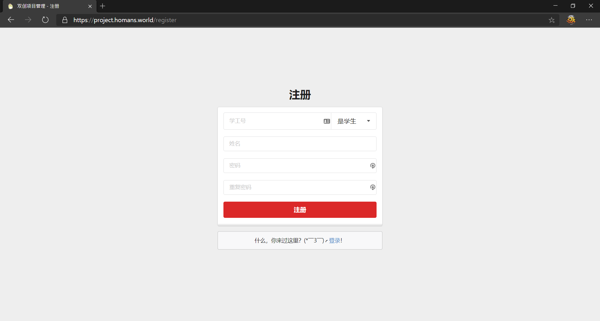

# Project Management Platform

## Intro

A J2EE project using **Springboot**, **Thymeleaf**, **Semantic UI** and **MySQL**.

Demo: [project.homans.world](https://project.homans.world)

服务器部署在 Google Cloud Platform 香港节点，加载速度视网络情况。


## Pages

1. Login


2. Register



3. Homepage


4. Personal Profile


5. Project Application


6. Project Management


## Features

为测试项目，为各个身份设置一个测试账号（账号同密码）：

1. 学生：
   * 账号：100010
   * 姓名：学生1
2. 项目导师：
   * 账号：100020
   * 姓名：项目导师1
3. 评审导师：
   * 账号：100030
   * 姓名：评审导师1
4. 管理员：
   * 账号：1000
   * 姓名：root

各身份的功能：

* 学生成员：注册、登录、个人信息管理、我的项目（组队信息）、提交项目，修改项目信息、查看项目状态信息。
* 项目导师：登录，确认学生选题，查看负责项目信息，对项目提出建议。
* 评审导师：登录，可查看项目，下载附件，对项目评价审核，打分。
* 管理员：项目类别管理，项目管理，项目成绩管理。


## Semantic UI

Semantic UI 提供了丰富的组件和可以自定义主题的功能，同时我们通过使用 Semantic UI 实现了在移动端使用的响应式设计。

### 编译样式文件

要使用 Semantic UI ，先需通过 npm 安装社区版的 Fomantic UI。项目中有已编译好的 css / js 文件位于 `/src/main/resources/static/dist/` 目录。如需修改 UI 风格，可以自行修改 `/semantic` 中的配置文件进行编译。具体方法如下：

* To build Semantic UI asset files, run `gulp build` under `/semantic`.
* To change output path, edit `/semantic.json`.
* Output folder is currently set to `/src/main/resources/static/dist/`.

Reference: <https://semantic-ui.com/introduction/build-tools.html>


## Thymeleaf

通过使用 Thymeleaf 模板技术，我们可以实现前端设计与后端开发的分离。相对于 JSP ， Thymeleaf 模板文件更加直观，能够解决通过 JSP 开发时需要启动 Tomcat 才能显示页面的问题。同时，通过 Thymeleaf 引用模板 html 中的片段可以大大简化其它页面的文件大小。模板文件位于 `/src/main/resources/templates` 。

图为在 IDEA 中直接通过浏览器打开 `common.html` 模板的效果。通过 Springboot 启动后，用户名字和学工号等信息会被 Thymeleaf 模板引擎进行相应替换。


模板文件的部分代码：


## Responsive Design

手机是现今我们离不开的工具，该项目针对移动设备做了显示优化。以下展示了手机端部分显示截图。


## GitHub

该项目在通过存储在 GitHub 仓库来与组员进行协作， commit 记录完整地记录了我们的项目开发过程。

Link: <https://github.com/homanw104/ProjectManagement>


## Authors

* 王皜民：前端设计与搭建、后端数据库、服务器部署等全栈开发。
* 苏建锐：项目需求分析、前端搭建、后端数据库对接、实验报告的撰写等。
* 林颂家：项目需求分析、数据库表格设计等。


## Licence

This project is licenced under GPL-3.


## Details

关于更多技术细节，可以查看项目报告ヾ(•ω•`)o

Crafted with dove by Homan & Temper.

Date: Jan 2021


## Appendix

Project structure.

```txt
./src/main
├── java
│   └── world
│       └── homans
│           └── projectmanagement
│               ├── controller
│               │     ├── ApplicationController.java
│               │     ├── DownloadController.java
│               │     ├── IndexController.java
│               │     ├── LoginController.java
│               │     ├── LogoutController.java
│               │     ├── ManagementController.java
│               │     ├── ProfileController.java
│               │     ├── ProjectController.java
│               │     └── RegisterController.java
│               ├── entity
│               │     ├── Gender.java        性别Enum类
│               │     ├── Profile.java       用户具体信息实体类
│               │     ├── Progress.java      项目进度Enum类
│               │     ├── Project.java       项目信息实体类
│               │     ├── Role.java          用户角色Enum类
│               │     ├── Status.java        用户账户情况Enum类
│               │     └── User.java          用户关键信息实体类
│               ├── repository
│               │     ├── ProfileRepository.java  用户详细信息仓库
│               │     ├── ProjectRepository.java  项目信息仓库
│               │     └── UserRepository.java     用户基础信息类
│               ├── security
│               │     └── SecurityConfig.java     Spring Boot安全设置
│               ├── service
│               │   ├── ProfileService.java   用户详细信息增删改查服务
│               │   ├── ProjectService.java   项目信息增删改查服务
│               │   └── UserService.java      用户基本信息增删改查服务
│               └── ProjectManagementApplication.java
└── resources
    ├── application.properties
    ├── static
    │     ├── css
    │     │     ├── common.css
    │     │     ├── login.css
    │     │     └── register.css
    │     ├── dist (semantic-ui resources)
    │     │     ├── components ...
    │     │     ├── semantic.css
    │     │     ├── semantic.js
    │     │     ├── semantic.min.css
    │     │     ├── semantic.min.js
    │     │     └── themes
    │     │         ├── basic ...
    │     │         └── default ...
    │     ├── img
    │     │     ├── head_chicken.jpg
    │     │     ├── head_tutor.png
    │     │     ├── head_user.jpg
    │     │     ├── icon.png
    │     │     ├── login.jpg
    │     │     └── logo.jpg
    │     └── js
    │         ├── common.js
    │         ├── jquery-3.5.1.min.js
    │         ├── login.js
    │         └── register.js
    └── templates
        ├── index
        │     ├── index-admin.html
        │     ├── index-assessor.html
        │     ├── index-student.html
        │     └── index-tutor.html
        ├── management
        │     ├── management-admin.html
        │     ├── management-assessor.html
        │     ├── management-student.html
        │     └── management-tutor.html
        ├── application.html
        ├── common.html
        ├── login.html
        ├── profile-edit.html
        ├── profile.html
        ├── project-edit.html
        └── register.html
```
