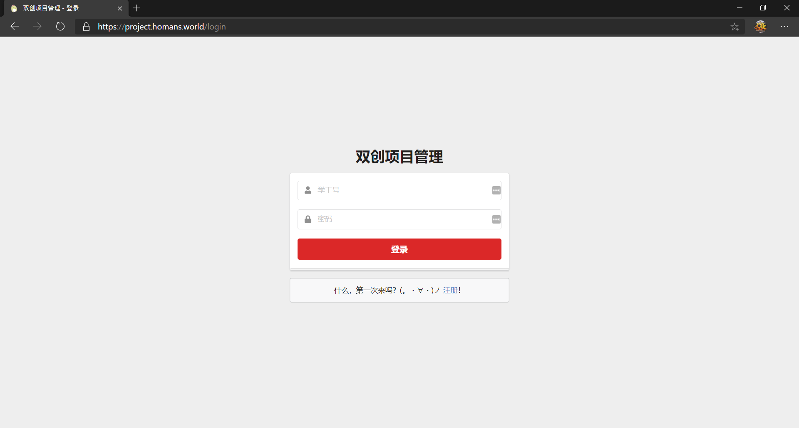

# Project Management Platform

## Intro

A J2EE project using **Springboot**, **Thymeleaf**, **Semantic UI** and **MySQL**.

Demo: [project.homans.world](https://project.homans.world)

## Main Pages

1. Login

2. Register

3. Homepage

4. Personal Profile

5. Project Application

6. Project Management

## Main Features

为测试项目，为各个身份设置一个测试账号（账号同密码）：

1. 学生：
   * 账号：100010
   * 姓名：学生1
2. 项目导师：
   * 账号：100020
   * 姓名：项目导师1
3. 评审导师：
   * 账号：100030
   * 姓名：评审导师1
4. 管理员：
   * 账号：1000
   * 姓名：root

各身份的功能：

* 学生成员：注册、登录、个人信息管理、我的项目（组队信息）、提交项目，修改项目 信息、查看项目状态信息
* 项目导师：登录，确认学生选题，查看负责项目信息，对项目提出建议
* 评审导师：登录，可查看项目，下载附件，对项目评价审核，打分
* 管理员：项目类别管理，项目管理，项目成绩管理；项目评审，专家信息管理，管理中 包括基本信息的增、删、改、查

## Group division of work

## Semantic UI

Reference: <https://semantic-ui.com/introduction/build-tools.html>

* To build Semantic UI asset files run `gulp build` under `/semantic`.
* The output folder is set as

## Thymeleaf

## GitHub Link

https://github.com/homanw104/ProjectManagement

## Authors

* 王皜民：前端设计与搭建、后端数据库、服务器部署等全栈开发
* 苏建锐：项目需求分析、前端搭建、后端数据库对接、实验报告的撰写等
* 林颂家：项目需求分析、数据库表格设计等

## Licence

This project is licenced under GPL-3.
